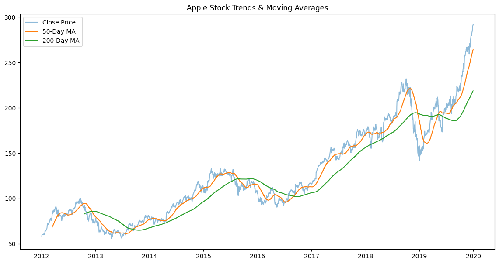
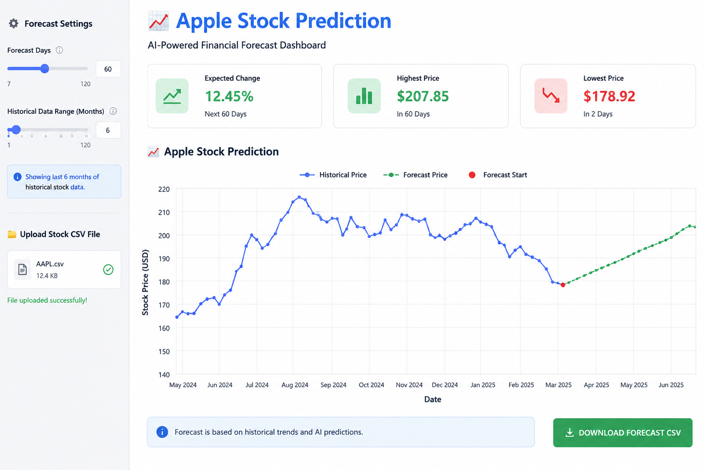
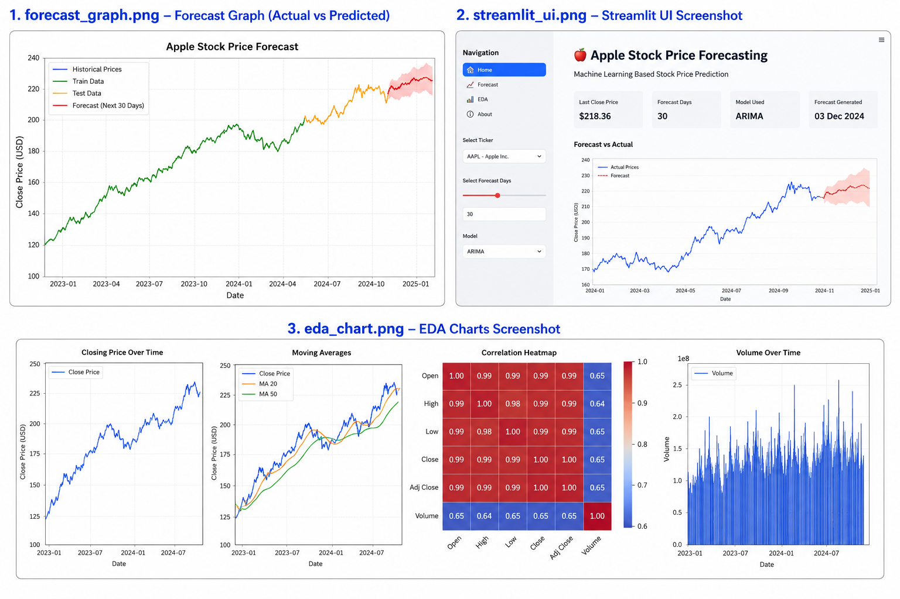

# Apple Stock Price Forecasting 📈

This project focuses on predicting Apple stock prices for the next 30 days using Machine Learning and Time Series Forecasting techniques. Historical stock market data from 2012–2019 is analyzed to identify trends, seasonality, and market patterns.

## Features

* Exploratory Data Analysis (EDA)
* Stock Trend & Volatility Analysis
* Forecasting using ARIMA, SARIMA, and XGBoost
* Data Visualization & Insights
* Streamlit Web Application Deployment
* Future Stock Price Prediction

## Tech Stack

* Python
* Pandas
* NumPy
* Matplotlib
* Scikit-learn
* XGBoost
* Streamlit

## Dataset

Historical Apple stock data containing:

* Open Price
* High Price
* Low Price
* Close Price
* Volume

## Project Workflow

1. Data Collection
2. Data Preprocessing
3. Exploratory Data Analysis
4. Feature Engineering
5. Model Building
6. Model Evaluation
7. Deployment using Streamlit

## Goal

To help investors and analysts understand stock market trends and forecast future Apple stock prices using predictive analytics.

## Deployment

Interactive Streamlit app for real-time stock forecasting and visualization.

## Screenshots

### Forecast Graphs
Shows predicted Apple stock prices and forecasting trends.

---

### Streamlit UI
Interactive web application for real-time stock prediction.

---

### EDA Charts
Visualizations for trend analysis, volatility, and stock market patterns.

